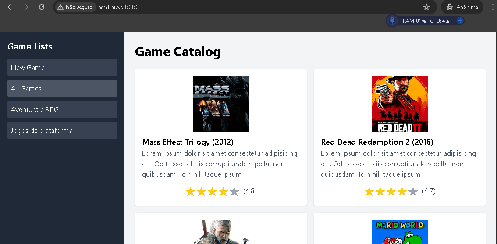

<!-- 
  Tags: Dev, Monolíto
  Label: 📦 PostgreSQL, JPA e API RESTful em Java Spring.
  Description: Projeto DSList com PostgreSQL, JPA e API RESTful em Java Spring.
  path_hook: hookfigma.hook11, hookfigma.hook14
-->
# ✨ Projeto Intensivão Java Spring - Maio/25

Este projeto foi desenvolvido durante o Intensivão Java Spring, edição de maio de 2025, ministrado por **Nélio Alves** do **DevSuperior**.


Este projeto representa um passo importante na minha jornada para a carreira backend Java, uma área com grande demanda e excelentes oportunidades no mercado de desenvolvimento.


Obrigado a todos!


## 🔭 Visão Geral



O `gmcatalog` é uma aplicação backend desenvolvida com **Java** e o framework **Spring Boot**. Seu objetivo principal é gerenciar listas de jogos, permitindo a criação de listas personalizadas e a organização de jogos dentro dessas listas. A aplicação segue a arquitetura de uma **API RESTful**, possibilitando a interação com os dados por meio de requisições HTTP. Vamos entender como ele funciona:

## 💡 Funcionalidades
- **Listar todos os jogos**: Retorna uma lista de jogos com informações resumidas.
- **Buscar detalhes de um jogo**: Recupera informações completas de um jogo específico pelo seu ID.
- **Listar todas as listas de jogos**: Retorna todas as listas de jogos disponíveis.
- **Listar jogos de uma lista específica**: Exibe os jogos pertencentes a uma lista, ordenados por posição.
- **Movimentar jogos em uma lista**: Permite reordenar jogos dentro de uma mesma lista.

## 🚀 Tecnologias Utilizadas

- **Java**: Linguagem de programação principal (versão 21).
- **Spring Boot**: Framework para desenvolvimento rápido de aplicações web e microsserviços.
- **Spring Web**: Módulo para construção de APIs RESTful com Spring MVC.
- **Spring Data JPA**: Facilita o acesso e manipulação de dados com JPA.
- **Hibernate**: Implementação do JPA para mapeamento objeto-relacional.
- **H2 Database**: Banco de dados em memória para desenvolvimento e testes.
- **PostgreSQL**: Banco de dados relacional para ambientes de produção.
- **Lombok**: Biblioteca para reduzir código boilerplate.
- **Maven**: Ferramenta de gerenciamento de dependências e build.
- **HTML**: Linguagem de marcação para a estrutura da página.
- **CSS**: (Tailwind CSS): Framework CSS para estilização rápida e responsiva.
- **JavaScript**: Linguagem de programação para interatividade no frontend.
- **React**: Biblioteca JavaScript para construção de interfaces de usuário.
- **Babel**: Transpilador JavaScript para compatibilidade do React e JSX.

## 📚 Resumo da Estrutura do Projeto

O projeto segue as convenções do Spring Boot, com uma organização em pacotes para separação de responsabilidades:

- `com.gamecatalog.gmcatalog`: Pacote raiz da aplicação.
- `com.gamecatalog.gmcatalog.config`: Configurações, como CORS (`WebConfig`).
- `com.gamecatalog.gmcatalog.controllers`: Controladores REST (`GameController`, `GameListController`).
- `com.gamecatalog.gmcatalog.dto`: DTOs para transporte de dados (`GameDTO`, `GameListDTO`, `GameMinDTO`, `ReplacementDTO`).
- `com.gamecatalog.gmcatalog.entities`: Entidades do banco de dados (`Belonging`, `BelongingPK`, `Game`, `GameList`).
- `com.gamecatalog.gmcatalog.projections`: Projeções para consultas JPQL (`GameMinProjection`).
- `com.gamecatalog.gmcatalog.repositories`: Repositórios JPA (`GameListRepository`, `GameRepository`).
- `com.gamecatalog.gmcatalog.services`: Lógica de negócios (`GameListService`, `GameService`).

---

## 📚 Estrutura e Tecnologias do Projeto

O projeto é desenvolvido em Java e utiliza o framework Spring Boot, que facilita a criação de aplicações Spring prontas para produção. Veja os principais componentes e tecnologias envolvidas:

* **`pom.xml` (Maven Project Object Model):** Este arquivo define as dependências do projeto, o processo de build e metadados.
    * **`spring-boot-starter-parent`**: Fornece configurações padrão para projetos Spring Boot.
    * **`spring-boot-starter-data-jpa`**: Habilita a **JPA (Java Persistence API)** para interação com o banco de dados, usando o **Hibernate** como ferramenta ORM (Mapeamento Objeto-Relacional).
    * **`spring-boot-starter-web`**: Inclui dependências para construir aplicações web, incluindo **APIs RESTful**, usando Spring MVC.
    * **`h2database` (H2)**: Um banco de dados em memória usado para desenvolvimento e testes (`scope=runtime`). Isso significa que ele está disponível durante a execução, mas não é empacotado na implantação final.
    * **`postgresql`**: Um banco de dados relacional de código aberto popular, também usado para produção (`scope=runtime`).
    * **`spring-boot-starter-test`**: Oferece utilitários para testar aplicações Spring Boot.
    * **`java.version`**: Definido como `21`, indicando a versão do JDK (Java Development Kit) utilizada.
* **Maven Wrapper (`mvnw`, `mvnw.cmd`):** Scripts que permitem compilar o projeto sem ter o Maven instalado globalmente em sua máquina. Eles baixam uma versão específica do Maven se necessário.
* **`GmcatalogApplication.java`**: É o ponto de entrada principal da aplicação Spring Boot. A anotação `@SpringBootApplication` combina `@Configuration`, `@EnableAutoConfiguration` e `@ComponentScan`, tornando-o uma aplicação Spring Boot típica.
* **`Game` (Entidade):**
    * Localizada em `com.gamecatalog.gmcatalog.entities`.
    * Representa um jogo no banco de dados.
    * Anotada com `@Entity` e `@Table(name = "tb_game")` para mapeá-la à tabela `tb_game`.
    * Usa `@Id` e `@GeneratedValue(strategy = GenerationType.IDENTITY)` para geração automática de ID.
    * Inclui campos como `title`, `year`, `genre`, `platforms`, `score`, `imgUrl`, `shortDescription` e `longDescription`.
    * `@Column(name = "game_year")` mapeia explicitamente o campo `year` para uma coluna chamada `game_year`.
    * `@Column(columnDefinition = "TEXT")` é usado para `shortDescription` e `longDescription` para permitir entradas de texto mais longas no banco de dados.
* **`GameMinDTO` (Objeto de Transferência de Dados - DTO):**
    * Localizada em `com.gamecatalog.gmcatalog.dto`.
    * Uma representação simplificada de uma entidade `Game`, contendo apenas `id`, `title`, `year`, `imgUrl` e `shortDescription`.
    * DTOs são usados para transferir dados entre camadas (por exemplo, da camada de serviço para o controlador) e para expor apenas as informações necessárias ao cliente, melhorando a segurança e o desempenho.
* **`GameRepository` (Repositório):**
    * Localizada em `com.gamecatalog.gmcatalog.repositories`.
    * Uma interface que estende `JpaRepository`, fornecendo operações CRUD (Criar, Ler, Atualizar, Excluir) padrão para a entidade `Game` sem a necessidade de escrever código repetitivo.
* **`GameService` (Serviço):**
    * Localizada em `com.gamecatalog.gmcatalog.services`.
    * Anotada com `@Service`, indicando que é um componente de lógica de negócios.
    * Usa `@Autowired` para injetar `GameRepository`.
    * Contém o método `findAll()`, que recupera todas as entidades `Game` do banco de dados, as converte em objetos `GameMinDTO` e retorna uma lista desses DTOs. Essa transformação garante que apenas os dados mínimos necessários sejam expostos.
* **`GameController` (Controlador):**
    * Localizada em `com.gamecatalog.gmcatalog.controllers`.
    * Anotada com `@RestController` e `@RequestMapping(value = "/games")`, indicando que é um controlador REST que lida com requisições para o endpoint `/games`.
    * Usa `@Autowired` para injetar `GameService`.
    * A anotação `@GetMapping` no método `findAll()` mapeia as requisições HTTP GET para `/games` a este método, que então chama o `GameService` para buscar os dados do jogo e retorná-los ao cliente.
## Arquivos de Configuração (`.properties`)

Esses arquivos controlam o comportamento da sua aplicação Spring Boot, especialmente a conexão com o banco de dados e as configurações por ambiente.

---

### `application-test.properties` (Perfil de Teste - H2 Database)

* **Finalidade:** Exclusivo para o **perfil de `test`**.
* **Conexão H2:** Configura um **banco de dados H2 em memória** para testes rápidos.
* **Console H2:** Ativa o **console web do H2** (`/h2-console`) para visualização do banco de dados em desenvolvimento.
* **Mostrar SQL:** Configura o Hibernate para **exibir as instruções SQL** no console, útil para depuração.

---

### `application.properties` (Configurações Gerais e PostgreSQL)

* Gerencia as configurações principais da aplicação, aplicáveis a diversos ambientes.
* **Ativação de Perfil:** `spring.profiles.active=test` define o perfil padrão. Pode ser alterado para `dev`, `prod`, ou via variável de ambiente.
* **Comportamento JPA:** `spring.jpa.open-in-view=false` evita problemas de "N+1 selects" e *lazy loading* fora de transações em APIs REST.
* **Conexão H2 Remota:** `spring.h2.console.settings.web-allow-others=true` permite conexões remotas ao console H2 (para desenvolvimento).
* **CORS:** `cors.origins` define as origens permitidas para **Cross-Origin Resource Sharing**, permitindo o acesso de frontends de diferentes domínios.
* **Conexão PostgreSQL (Variáveis de Ambiente):**
    * `spring.datasource.url=${DB_URL}`: URL do banco de dados via **variável de ambiente**.
    * `spring.datasource.username=${DB_USERNAME}`: Usuário do banco de dados via **variável de ambiente**.
    * `spring.datasource.password=${DB_PASSWORD}`: Senha do banco de dados via **variável de ambiente**.
* **Dialeto Hibernate:** `spring.jpa.database-platform=org.hibernate.dialect.PostgreSQLDialect` otimiza a comunicação com PostgreSQL.
* **Gerenciamento de LOBs:** `spring.jpa.properties.hibernate.jdbc.lob.non_contextual_creation=true` previne problemas com manipulação de dados grandes.
* **Geração de DDL:** `spring.jpa.hibernate.ddl-auto=none` **impede a modificação automática do esquema do banco de dados** na inicialização, prática recomendada em produção.

---

### `import.sql` (População Inicial do Banco de Dados)

* **Localização:** Geralmente em `src/main/resources`.
* **Funcionalidade:** Executado automaticamente pelo Spring Boot/Hibernate ao iniciar a aplicação (especialmente com H2) para **popular o banco de dados com dados iniciais** para desenvolvimento e testes.

---

### Exemplo de Configuração Direta para PostgreSQL (`application.properties` ou Perfil Específico)

* Demonstra uma configuração explícita para PostgreSQL, útil para desenvolvimento local sem variáveis de ambiente.
* **Ativação de Perfil (Comentada):** `#spring.profiles.active=${APP_PROFILE:dev} ou ${APP_PROFILE:prod}` sugere a ativação dinâmica de perfis.
* **Geração de Esquema para `create.sql` (Comentada):** Linhas comentadas para **gerar scripts SQL de criação de esquema** a partir de entidades JPA.
* **Conexão PostgreSQL (Direta):**
    * `spring.datasource.url=jdbc:postgresql://vmlinuxd:5433/gmcatalog`: URL direta para uma instância local de PostgreSQL.
    * `spring.datasource.username=postgres`: Nome de usuário direto.
    * `spring.datasource.password=1234567`: Senha direta (evitar em produção).
* **Dialeto Hibernate:** `spring.jpa.database-platform=org.hibernate.dialect.PostgreSQLDialect` mantém o dialeto correto.
* **Gerenciamento de LOBs:** `spring.jpa.properties.hibernate.jdbc.lob.non_contextual_creation=true` assegura compatibilidade.
* **Geração de DDL:** `spring.jpa.hibernate.ddl-auto=none` **mantém o esquema do banco de dados intacto**.

---

### 💡 1. Dinâmica de Funcionamento

Aqui está um passo a passo de como o projeto funciona:

*  **Inicialização da Aplicação:** Quando a aplicação `GmcatalogApplication` é executada, o Spring Boot inicializa o contexto da aplicação. Ele procura por componentes como controladores, serviços e repositórios.
*  **Inicialização do Banco de Dados (para o perfil `test`):**
    * Como `spring.profiles.active=test` e o H2 está configurado, o Spring Boot configura um banco de dados H2 em memória.
    * O script `import.sql` é executado, preenchendo a tabela `tb_game` com dados iniciais de jogos.
*  **Requisição do Cliente:** Um cliente (por exemplo, um navegador web ou uma aplicação frontend) envia uma requisição HTTP GET para `http://vmlinuxd:8080/games` (assumindo a porta padrão do Spring Boot 8080).
*  **Invocação do Controlador:** O `GameController` recebe esta requisição devido às suas anotações `@RequestMapping(value = "/games")` e `@GetMapping`.
*  **Chamada à Camada de Serviço:** O `GameController` então delega a requisição ao `GameService` chamando seu método `findAll()`.
*  **Interação com o Repositório:** O `GameService`, por sua vez, chama o método `findAll()` do `GameRepository`. Este método (fornecido por `JpaRepository`) executa uma consulta SQL para recuperar todos os registros da tabela `tb_game` no banco de dados.
*  **Conversão de Entidade para DTO:** O `GameRepository` retorna uma `List<Game>` (uma lista de entidades `Game`). O `GameService` então processa esta lista, convertendo cada entidade `Game` em um objeto `GameMinDTO`. Isso é feito usando um *stream* e a operação `map`, seguida por `toList()` para coletar os resultados. Isso garante que dados sensíveis ou desnecessários não sejam expostos ao cliente.
*  **Resposta ao Cliente:** O `GameService` retorna a `List<GameMinDTO>` para o `GameController`. O `GameController` então serializa esta lista em uma resposta JSON (JavaScript Object Notation) e a envia de volta ao cliente.

Em resumo, este projeto oferece uma **API de backend** simples, mas eficaz, para gerenciar uma lista de jogos, demonstrando conceitos essenciais do Spring Boot, como **controladores REST, serviços, repositórios, entidades JPA, DTOs e integração com banco de dados.**

### 2. 📊 Modelagem de Dados (Entidades)

O projeto possui um modelo de dados relacional mapeado para objetos Java usando JPA (Java Persistence API) com Hibernate:

* **`Game.java`**: Representa um jogo no banco de dados (`tb_game`), contendo informações detalhadas como título, ano, gênero, plataformas, pontuação, URLs de imagem e descrições.
* **`GameList.java`**: Representa uma lista de jogos (`tb_game_list`), com um ID e um nome.
* **`Belonging.java`**: Representa a relação muitos-para-muitos entre `Game` e `GameList`, indicando que um jogo pertence a uma lista. Contém um campo `position` para ordenar os jogos dentro de uma lista.
* **`BelongingPK.java`**: É uma classe `@Embeddable` que serve como chave primária composta para a entidade `Belonging`, contendo referências a `Game` e `GameList`.

### 3. 🗄️ Camada de Repositórios

* **`GameRepository.java`**: Estende `JpaRepository`, fornecendo métodos CRUD básicos para a entidade `Game`. Contém uma consulta nativa (`@Query`) para buscar jogos que pertencem a uma lista específica, ordenados pela posição, retornando uma `GameMinProjection`.
* **`GameListRepository.java`**: Também estende `JpaRepository`, fornecendo métodos CRUD para a entidade `GameList`. Inclui um método `@Modifying` com `@Query` para atualizar a posição de um jogo dentro de uma lista.

### 4. 🛠️ Camada de Serviços

A camada de serviço contém a lógica de negócios e orquestra as operações com os repositórios:

* **`GameService.java`**:
    * `findById(Long id)`: Busca um jogo pelo ID e retorna um `GameDTO` (uma versão mais completa dos dados do jogo).
    * `findAll()`: Retorna uma lista de todos os jogos, mapeados para `GameMinDTO` (uma versão resumida dos dados do jogo).
    * `findByGameList(Long listId)`: Busca todos os jogos pertencentes a uma lista específica, utilizando a projeção `GameMinProjection` para otimizar a consulta e mapeando-os para `GameMinDTO`.
* **`GameListService.java`**:
    * `findAll()`: Retorna uma lista de todas as listas de jogos, mapeadas para `GameListDTO`.
    * `move(Long listId, int sourceIndex, int destinationIndex)`: Este é um método transacional complexo que permite reordenar os jogos dentro de uma lista. Ele recupera os jogos da lista, remove o jogo da posição de origem, insere-o na posição de destino e, em seguida, atualiza as posições de todos os jogos afetados no banco de dados.

### 5. 📦 Camada de DTOs (Data Transfer Objects)

DTOs são usados para transferir dados entre as camadas da aplicação (por exemplo, do serviço para o controlador) e para expor apenas os dados necessários aos clientes:

* **`GameDTO.java`**: Representação completa de um `Game` para detalhes específicos de um jogo.
* **`GameMinDTO.java`**: Representação mínima de um `Game`, usada para listagens rápidas. Pode ser criada a partir de uma entidade `Game` ou de uma `GameMinProjection`.
* **`GameListDTO.java`**: Representação de uma `GameList`, contendo apenas o ID e o nome.
* **`ReplacementDTO.java`**: Usado para receber os índices de origem e destino ao mover um jogo dentro de uma lista.

### 6. 🌐 Camada de Controladores (APIs RESTful)

Os controladores expõem os endpoints da API, recebendo requisições HTTP e retornando respostas:

* **`GameController.java`**:
    * `GET /games`: Retorna uma lista de todos os jogos (`List<GameMinDTO>`).
    * `GET /games/{id}`: Retorna os detalhes completos de um jogo específico pelo seu ID (`GameDTO`).
* **`GameListController.java`**:
    * `GET /lists`: Retorna uma lista de todas as listas de jogos (`List<GameListDTO>`).
    * `GET /lists/{listId}/games`: Retorna os jogos que pertencem a uma lista específica, ordenados pela posição (`List<GameMinDTO>`).
    * `POST /lists/{listId}/replacement`: Permite reordenar os jogos dentro de uma lista. Recebe um `ReplacementDTO` no corpo da requisição com os índices de origem e destino.

### 7. ⚙️ Configuração Adicional

* **`WebConfig.java`**: Configura o **CORS (Cross-Origin Resource Sharing)**, permitindo que aplicações frontend de domínios específicos (definidos na propriedade `cors.origins` nos arquivos `.properties`) acessem a API.
* **Arquivos de Propriedades (`application.properties`, `application-test.properties`, etc.)**:
    * `spring.datasource.url`, `username`, `password`: Definem as credenciais e URL do banco de dados (H2 para `test`, PostgreSQL para `dev`/`prod`).
    * `spring.h2.console.enabled=true` e `spring.h2.console.path=/h2-console`: Habilitam o console H2 para visualizar o banco de dados em memória.
    * `spring.jpa.show-sql=true`: Mostra as queries SQL geradas pelo Hibernate no console.
    * `spring.jpa.hibernate.ddl-auto=none`: Indica que o Hibernate não deve gerenciar automaticamente o esquema do banco de dados (o que é comum em produção, onde o esquema é gerenciado manualmente ou por scripts de migração).

### 🖥️ Configuração Opcional do Arquivo hosts

* **Para acessar funcionalidades via http://vmlinuxd:8080, adicione esta linha ao seu arquivo hosts:
```Bash
Windows: C:\Windows\System32\drivers\etc\hosts (abra como administrador)
Linux/macOS: /etc/hosts (use sudo para editar)
```
Adicione a linha:
```Bash
127.0.0.1 vmlinuxd
```
Isso associa o nome vmlinuxd ao endereço 127.0.0.1 no seu computador, permitindo acesso local facilitado. Salve o arquivo após a modificação. Essa etapa é opcional e útil para acessar os dashboards locais.

## ⚙️ Como Executar a Aplicação

1.  **✅ Pré-requisitos:**
    * Java Development Kit (JDK) 17 ou superior instalado.
    * Maven instalado.

2.  **⬇️ Clonar o Repositório (se aplicável):**
    ```bash
    git clone https://github.com/fabiuniz/gmcatalog-rest.git
    cd gmcatalog
    ```

3.  **▶️ Executar a Aplicação:**
    Você pode executar a aplicação de duas maneiras:

    * **Usando o Maven:**
        ```bash
        mvn spring-boot:run
        ```

    * **Executando a classe principal:**
        Localize a classe `GmcatalogApplication.java` dentro do pacote `com.gamecatalog.gmcatalog` e execute-a como uma aplicação Java em sua IDE (IntelliJ IDEA, Eclipse, etc.).

4.  **📡 Acessar a API:**
    Após a aplicação ser iniciada, você poderá acessar os endpoints da API através de ferramentas como o Postman, Insomnia ou um navegador web. Alguns endpoints de exemplo:

    * `GET /games`: Lista todos os jogos em formato `GameMinDTO`.
    * `GET /games/{id}`: Busca os detalhes do jogo com o ID especificado em formato `GameDTO`.
    * `GET /lists`: Lista todas as listas de jogos em formato `GameListDTO`.
    * `GET /lists/{listId}/games`: Lista os jogos da lista com o ID especificado em formato `GameMinDTO`.
    * `POST /lists/{listId}/replacement`: Permite mover um jogo de uma posição para outra dentro da lista especificada (requer um corpo JSON com `sourceIndex` e `destinationIndex`).

## ➡️ Fluxos de Dados dos Endpoints

### 1. `GET /games`
- **Fluxo**: `GameController` → `GameService` → `GameRepository` → `GameMinProjection` → `GameMinDTO` → `GameController` → Cliente.
- **Descrição**: Retorna uma lista de todos os jogos em formato resumido.

### 2. `GET /games/{id}`
- **Fluxo**: `GameController` → `GameService` → `GameRepository` → `Game` → `GameDTO` → `GameController` → Cliente.
- **Descrição**: Retorna detalhes completos de um jogo específico.

### 3. `GET /lists`
- **Fluxo**: `GameListController` → `GameListService` → `GameListRepository` → `GameList` → `GameListDTO` → `GameListController` → Cliente.
- **Descrição**: Retorna todas as listas de jogos.

### 4. `GET /lists/{listId}/games`
- **Fluxo**: `GameListController` → `GameService` → `GameRepository` → `GameMinProjection` → `GameMinDTO` → `GameListController` → Cliente.
- **Descrição**: Retorna jogos de uma lista específicaD, ordenados por posição.

### 5. `POST /lists/{listId}/replacement`
- **Fluxo**: `GameListController` → `GameListService` → `GameRepository` → Atualiza posições → `GameListService` → `GameListController` → Cliente.
- **Descrição**: Reordena jogos em uma lista com base em `sourceIndex` e `destinationIndex`.

## 🐳 Executando o PostgreSQL Localmente com Docker Compose (Opcional):
- Para um ambiente de desenvolvimento local robusto e isolado, você pode usar Docker Compose para subir uma instância do PostgreSQL. Isso garante que seu banco de dados esteja sempre limpo e consistente, sem interferir em outras instalações locais de PostgreSQL.

- Certifique-se de ter Docker e Docker Compose instalados em seu sistema.
- Crie um arquivo docker-compose.yml na raiz do seu projeto com a configuração do serviço PostgreSQL.
- Execute docker-compose up -d no terminal, na pasta do projeto, para iniciar o contêiner do banco de dados.

## 📊 Homologação Local:
- Após iniciar a aplicação localmente e acessar a API, a etapa de homologação envolve a validação das funcionalidades. Você pode utilizar ferramentas de teste de API como Postman, Insomnia ou comandos curl diretamente do terminal para enviar requisições HTTP aos endpoints (/games, /lists, etc.) e verificar se as respostas estão corretas, os dados estão sendo manipulados adequadamente, e se a aplicação se comporta conforme o esperado em diversos cenários de uso.

## ⚡ CI/CD para o gmcatalog: Automação da Entrega e Qualidade
- CI/CD (Integração Contínua e Entrega Contínua) é essencial para o gmcatalog, automatizando a construção, testes e implantação do código. Ele atua como uma esteira de produção que garante entregas rápidas e confiáveis.

- Benefícios e Fluxo Simplificado
A cada push de código para o GitHub, um fluxo de CI/CD via GitHub Actions é acionado:

- Integração Contínua (CI): O código é automaticamente compilado e todos os testes são executados. Isso fornece feedback instantâneo sobre a qualidade e integridade do gmcatalog, identificando erros rapidamente.
- Entrega Contínua (CD): Se a etapa de CI for bem-sucedida, a aplicação é automaticamente empacotada (.jar) e implantada em um ambiente de produção (como o Railway, por exemplo). Isso permite que novas funcionalidades e correções cheguem aos usuários de forma ágil e com alta confiabilidade, liberando a equipe para focar no desenvolvimento.
Esse processo otimiza o tempo da equipe e assegura a manutenção contínua da qualidade do gmcatalog.

## 🙏 Agradecimentos

Gostaria de expressar minha profunda gratidão:

* A **Nélio Alves** e toda a equipe da **DevSuperior** por criarem um treinamento tão completo e prático como o **Intensivão Java Spring**. A clareza das explicações e a abordagem focada em projetos são inestimáveis para o aprendizado.

**Nota**: Este projeto é um resultado direto do conhecimento adquirido no curso e reflete as melhores práticas para construção de APIs RESTful com Spring Boot durante o Intensivão Java Spring. Muito obrigado!

---

## 👨‍💻 Autor

[Fabiano Rocha/Fabiuniz]

## Licença

Este projeto está licenciado sob a [MIT License](LICENSE).
